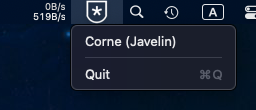
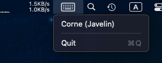

# javelin-steno-menubar

Menu bar icon that shows if steno mode or qwerty is active.

Steno mode:

QWERTY mode:

I have no idea how to write Swift code. This project shouldn't be used as an example for anything.
